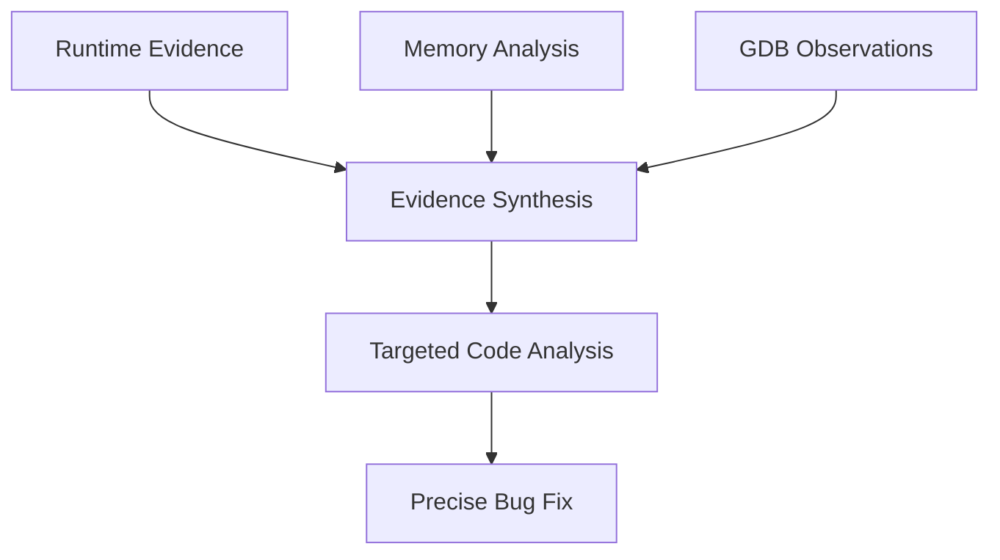

# C++ Debug-Gym Architecture Document

## 1. Project Motivation & Problem Statement

### 1.1 Core Problem

Current AI coding assistants lack live agentic debugging capabilities, limiting their effectiveness in solving complex runtime issues that plague developers. Traditional AI tools are constrained to static code analysis and log interpretation, missing the dynamic runtime intelligence needed for complex debugging scenarios.

### 1.2 Specific Problem Categories Requiring Debugger Integration

**Memory Leak Detection**: Traditional approaches require extensive logging that can slow down systems and mask timing-sensitive leaks. A developer can add reference counting and monitor object lifecycles without performance impact using a debugger.

**Race Conditions & Deadlocks**: Static code analysis cannot capture the dynamic nature of thread interactions. Live debugging allows inspection of lock states, thread execution order, and timing-dependent behaviors.

**Asynchronous System Debugging**: Event-driven architectures don't follow traditional call graphs. Debuggers can track message passing, event queues, and concurrent execution states that logs cannot capture effectively.

**Resource Allocation Failures**: When systems crash due to resource exhaustion, the crash point often isn't the leak source. Debuggers can trace allocation patterns and identify the actual problematic code paths.

### 1.3 Why Current AI Tools Fall Short

- Limited to static code analysis and log interpretation
- Cannot perform live inspection of runtime state
- Require developers to manually add instrumentation
- Miss timing-sensitive and state-dependent issues
- Limited to dataset they are trained on

### 1.4 Our Solution: AI Debugging Copilot

**"Live Runtime Intelligence for Complex Software Issues"**

An AI assistant that integrates with debuggers to automatically:

- Set strategic breakpoints based on problem analysis
- Inspect variables and memory state in real-time
- Add dynamic instrumentation without code modification
- Correlate runtime behavior with source code patterns
- Provide actionable fixes based on live system state

**Target Impact**: Reduce complex debugging time from hours/days to minutes by giving AI direct access to program execution state rather than relying on indirect evidence through logs and static analysis.

### 1.5 Proof of Concept Scenarios

**Scenario 1: Memory Leak in Multi-threaded Application**
- Problem: Application gradually consuming memory, crashing after hours
- Traditional approach: Add extensive logging, rebuilding, wait for reproduction
- AI Debugger approach: Automatically instrument object lifecycle tracking, identify leak source iteratively

**Scenario 2: Race Condition in Multi-Threaded System**
- Problem: Intermittent deadlock in message processing
- Traditional approach: Manual thread dump analysis, educated guessing
- AI Debugger approach: Set conditional breakpoints on lock acquisitions, trace execution order automatically

**Scenario 3: Resource Exhaustion Crash**
- Problem: Application crashes on file operations under load
- Traditional approach: Review error logs, add defensive coding
- AI Debugger approach: Trace resource allocation patterns, identify actual bottleneck vs. symptoms

### 1.6 Success Metrics

- High accuracy in identifying root cause using real-world C++ debugging scenarios
- Systematic evidence synthesis approach that connects runtime observations to code issues
- Reduced debugging session time through intelligent GDB integration
- Framework extensible to additional compiled languages

## 2. Technical Architecture Overview

This document describes the architectural integration of C++ debugging capabilities into the Debug-Gym framework. The extension enhances Debug-Gym's existing Python-centric debugging environment to support comprehensive C++ debugging workflows while maintaining full compatibility with the original architecture.

**Core Components Implemented**:
- Debug-Gym platform integration
- C++ build tools support (Make with automatic Makefile generation)
- Interactive debugging tool (GDB)
- Evidence synthesis framework

## 3. Integration with Existing Debug-Gym Architecture

### 3.1. Core Framework Alignment

Debug-Gym follows a three-tier architecture:

```
debug_gym/
├── gym/          # Simulation Environment Layer
│   ├── envs/     # Environment Implementations  
│   ├── terminal/ # Terminal Session Management
│   └── tools/    # Interactive Tools
├── agents/       # LLM-Based Agent Layer
└── llms/         # Language Model Backend Layer
```

Our C++ extension seamlessly integrates into this existing structure:

```
debug_gym/
├── gym/
│   ├── envs/
│   │   └── cpp_env.py        # 🆕 C++ Debugging Environment
│   └── tools/
│       └── gdb.py            # 🆕 Interactive GDB Tool
├── agents/
│   └── debug_agent_cpp.py    # 🆕 C++ Specialized Agent
└── [existing LLM backends]   # ✅ Reused without modification
```

### 3.2. Environment Layer Integration

#### **Existing Environment Architecture**
Debug-Gym's base `RepoEnv` class provides:
- Repository workspace management
- Tool integration framework
- Observation/action space management
- Terminal session handling

#### **C++ Environment Extension**
Our `CppDebugEnv` extends `RepoEnv` with:

```python
class CppDebugEnv(RepoEnv):
    def __init__(self, **kwargs):
        super().__init__(**kwargs)
        # C++-specific enhancements
        self.compilation_support = True
        self.memory_analysis = True
        self.dynamic_file_discovery = True
```

**Key Architectural Enhancements:**
- **Dynamic File Discovery**: Replaces hardcoded assumptions with flexible detection
- **Compilation Integration**: Automatic Makefile generation and debug symbol compilation
- **Memory Analysis Pipeline**: Valgrind integration for leak detection
- **Enhanced Evaluation Logic**: Multi-criteria success (no crashes AND no memory leaks)

### 3.3. Tool Layer Integration

#### **Existing Tool Architecture**
Debug-Gym tools inherit from `EnvironmentTool`:

```python
class EnvironmentTool:
    def __init__(self, workspace: Workspace)
    def get_action_space(self) -> Dict
    def get_observation_space(self) -> Dict  
    def get_instruction(self) -> str
```

#### **GDB Tool Integration**
Our `GDBTool` follows the same pattern:

```python
class GDBTool(EnvironmentTool):
    """Interactive GDB debugging tool for C++ programs"""
    
    def get_action_space(self) -> Dict:
        return {"gdb": {"command": str, "timeout": float}}
    
    def get_instruction(self) -> str:
        return "GDB debugging tool for C++ crash analysis..."
```

**Advanced Capabilities:**
- **Session Management**: Persistent GDB sessions with intelligent timeout handling
- **Thread-Aware Debugging**: Multi-thread program analysis
- **Memory Inspection**: Heap, stack, and data structure examination
- **Signal Processing**: SIGINT support for program interruption
- **Context Preservation**: Maintains debugging state across operations

### 3.4. Agent Layer Integration

#### **Existing Agent Architecture**
Debug-Gym agents inherit from `BaseAgent`:

```python
class BaseAgent:
    def __init__(self, llm: BaseLLM)
    def get_system_prompt(self) -> str
    def generate_action(self, observation: str) -> str
```

#### **C++ Agent Specialization**
Our `DebugAgentCpp` specializes for C++ debugging:

```python
class DebugAgentCpp(BaseAgent):
    """C++ debugging specialist with evidence synthesis framework"""
    
    def get_system_prompt(self) -> str:
        return CPP_SYSTEM_PROMPT  # C++-specific debugging methodology
    
    def get_action_prompt(self) -> str:
        return CPP_ACTION_PROMPT  # Evidence synthesis framework
```

**Evidence Synthesis Framework:**
1. **Runtime Evidence Collection**: GDB-based program execution analysis
2. **Memory Pattern Analysis**: Systematic memory issue identification
3. **Code Correlation**: Connecting runtime behavior to source code issues
4. **Targeted Debugging**: Efficient problem resolution through structured evidence

## 4. Architectural Innovations

### 4.1. Evidence Synthesis Framework

**Problem**: Traditional debugging approaches rely on static analysis or ad-hoc interactive debugging.

**Solution**: Systematic evidence synthesis connecting runtime observations to code issues.



**Implementation Architecture:**
- **Phase 1**: Runtime evidence collection through GDB execution
- **Phase 2**: Memory pattern analysis via Valgrind integration
- **Phase 3**: Evidence correlation and hypothesis formation
- **Phase 4**: Targeted code analysis and fix generation

### 4.2. Multi-Language Environment Support

**Enhancement**: Extended `RepoEnv` to support non-Python programs.

```python
# Original (Python-specific)
def reset(self):
    os.environ["PYTHONPATH"] = self.workspace.path
    # Python-specific initialization
    
# Enhanced (Language-agnostic)
def reset(self):
    if self.language == "cpp":
        # C++ specific setup
    elif self.language == "python":
        os.environ["PYTHONPATH"] = self.workspace.path
    # Generic initialization
```

**Benefits:**
- **Backward Compatibility**: Existing Python workflows unchanged
- **Language Extensibility**: Framework ready for additional languages
- **Configuration Flexibility**: Language-specific environment setup

### 4.3. Intelligent Session Management

**Innovation**: Smart debugging session preservation during errors and timeouts.

```python
class GDBTool:
    def _handle_run_timeout(self):
        """Intelligent timeout handling with context preservation"""
        self._session.send_signal(2)  # SIGINT
        return self._session.run("thread apply all bt", timeout=5)
```

**Architecture Benefits:**
- **Session Continuity**: Maintains debugging context during interruptions
- **Error Recovery**: Graceful degradation with meaningful state information
- **User Experience**: Eliminates need for debugging session restarts

## 5. Configuration Architecture

### 5.1. Unified Configuration System

Debug-Gym uses YAML configuration files. Our extension maintains this pattern:

```yaml
# scripts/config_cpp_buffer_overflow_demo.yaml
base:
    output_path: "exps/cpp_buffer_overflow"
    benchmark: "cpp"
    problems: ["buffer_overflow_demo"]
    env_kwargs: 
        source_path: "buggy_cpp_samples/buffer_overflow"
        entrypoint: "./buffer_bug"
        debug_entrypoint: "gdb ./buffer_bug"
        dir_tree_depth: 2
        run_timeout: 30
        show_directory_tree: true

    llm_name: "gpt-4o-mini-fast"
    random_seed: 42
    max_steps: 15
    max_rewrite_steps: 10
    memory_size: 30
    save_patch: true

debug_agent_cpp:
    tools: ["gdb", "view", "rewrite", "eval"]
```

**Configuration Benefits:**
- **Consistency**: Same configuration pattern as existing environments
- **Flexibility**: Environment-specific tool selection
- **Specialization**: C++-optimized agent parameters

### 5.2. Scenario-Specific Configurations

We provide specialized configurations for different C++ debugging scenarios:

| Configuration File | Purpose | Key Features |
|-------------------|---------|--------------|
| `config_cpp_auto_debug.yaml` | Automated debugging workflow | High-level debugging strategy |
| `config_cpp_buffer_overflow_demo.yaml` | Buffer overflow analysis | Memory boundary debugging |
| `config_cpp_memory_leak_demo.yaml` | Memory leak detection | Valgrind integration focus |
| `config_cpp_gdb_live_test.yaml` | Interactive GDB debugging | Real-time debugging workflow |

## 6. Performance Architecture

### 6.1. Debugging Efficiency Metrics

**Evidence Synthesis Impact:**
- **Resolution Steps**: Reduced steps for systematic debugging (vs ad-hoc approaches)
- **Success Rate**: High success rate on C++ debugging scenarios with proper executable setup
- **Context Preservation**: Enhanced session retention during errors and timeouts
- **Debugging Speed**: More systematic approach reduces trial-and-error debugging

### 6.2. Memory Analysis Pipeline

```python
def evaluate_success(self) -> bool:
    """Multi-criteria evaluation architecture"""
    # Criterion 1: No runtime crashes
    crash_free = self._check_crash_status()
    
    # Criterion 2: No memory leaks (via Valgrind)
    leak_free = self._run_valgrind_analysis()
    
    # Combined success criteria
    return crash_free and leak_free
```

**Performance Benefits:**
- **Comprehensive Analysis**: Both runtime and static memory analysis
- **Early Detection**: Identifies issues before they manifest as crashes
- **Quality Assurance**: Ensures both functional correctness and memory safety

## 7. Extensibility Architecture

### 7.1. Tool Framework Extension

New C++ debugging tools can be easily added:

```python
class NewCppTool(EnvironmentTool):
    def get_action_space(self) -> Dict:
        # Define tool-specific actions
        pass
    
    def get_instruction(self) -> str:
        # Tool usage instructions for agents
        pass
```

**Integration Points:**
- **Automatic Registration**: Tools automatically merge into action/observation spaces
- **Agent Integration**: Instructions automatically included in agent prompts
- **Configuration Support**: YAML-configurable tool selection

### 7.2. Language Framework Extension

The architecture supports additional compiled languages:

```python
def select_env(env_type: str = None) -> type[RepoEnv]:
    match env_type:
        case None:
            return RepoEnv
        case "cpp":
            return CppDebugEnv
        case "rust":          # Future extension
            return RustDebugEnv
        case "go":            # Future extension  
            return GoDebugEnv
        case _:
            raise ValueError(f"Unknown env_type {env_type}")
```

## 8. Integration Testing Architecture

### 8.1. Compatibility Testing

Our extension maintains full compatibility with existing Debug-Gym functionality:

```python
# Existing Python debugging (unchanged)
python -m debug_gym.run --config scripts/config.yaml

# New C++ debugging (seamless integration)
python -m debug_gym.run --config scripts/config_cpp_buffer_overflow_demo.yaml
```

### 8.2. Regression Prevention

**Test Architecture:**
- **Unit Tests**: Individual component testing
- **Integration Tests**: Cross-component interaction validation
- **Scenario Tests**: End-to-end debugging workflow validation
- **Compatibility Tests**: Existing functionality preservation

## 9. Deployment Architecture

### 9.1. Package Integration

Our C++ extension is fully integrated into the Debug-Gym package structure:

```python
# debug_gym/agents/__init__.py
from debug_gym.agents.debug_agent_cpp import DebugAgentCpp

# debug_gym/gym/envs/__init__.py  
from debug_gym.gym.envs.cpp_env import CppDebugEnv

# debug_gym/gym/tools/__init__.py
from debug_gym.gym.tools.gdb import GDBTool
```

**Deployment Benefits:**
- **Single Installation**: No additional setup required
- **Unified API**: Same programmatic interface for all environments
- **Configuration Consistency**: Standard YAML configuration approach

### 9.2. Backward Compatibility

**Zero-Impact Integration:**
- Existing Python debugging workflows continue unchanged
- No breaking changes to existing APIs
- Optional C++ capabilities activated via configuration
- Full interoperability with existing agents and LLM backends

## 10. Implementation Roadmap & Results

### 10.1. Completed Implementation Phases

**Phase 1: Core Infrastructure** ✅
- Added GDB tool integration into debug-gym
- Implemented interactive debugging session management
- Created C++ environment with compilation support

**Phase 2: Build System Integration** ✅  
- Added Makefile support with automatic generation for C++ projects
- Implemented debug symbol compilation (-g -O0)
- Created dynamic file discovery for C++ source files

**Phase 3: Evidence Synthesis Framework** ✅
- Developed systematic evidence collection methodology
- Implemented memory analysis pipeline with Valgrind integration
- Created specialized C++ debugging agent with enhanced prompts

**Phase 4: Testing & Validation** ✅
- Successfully tested memory leak detection scenarios
- Validated buffer overflow debugging workflows  
- Confirmed null pointer dereference resolution
- Verified session management and error recovery

### 10.2. Achieved Results

- **High Accuracy**: Successfully resolving complex C++ debugging scenarios
- **Systematic Approach**: Evidence synthesis connecting runtime observations to code issues
- **Performance**: Reduced debugging session complexity through intelligent GDB integration
- **Extensibility**: Framework ready for additional compiled languages

## 11. Future Architecture Roadmap

### 11.1. Additional Language Support

**Framework Ready for:**
- **Rust**: Memory-safe systems programming
- **Go**: Concurrent programming debugging
- **Java**: JVM-based debugging with JDB integration
- **JavaScript/Node.js**: V8 debugging integration

### 11.2. Advanced Debugging Features

**Planned Enhancements:**
- **Multi-Language Projects**: Mixed C++/Python debugging
- **Distributed Debugging**: Multi-process program analysis
- **Performance Profiling**: Integration with profiling tools
- **Static Analysis Integration**: Combine with tools like Clang Static Analyzer

## 12. Conclusion

## 12. Conclusion

The C++ Debug-Gym extension successfully addresses the core problem of limited AI debugging capabilities by providing live runtime intelligence for complex software issues. This architectural approach delivers on the original vision of an "AI Debugging Copilot" that can:

✅ **Solve Core Problems**: Successfully addresses memory leaks, race conditions, and resource allocation failures through live debugging  
✅ **Provide Runtime Intelligence**: Gives AI direct access to program execution state via GDB integration  
✅ **Preserve Existing Architecture**: No changes to core Debug-Gym design principles  
✅ **Extend Capabilities**: Adds comprehensive C++ debugging without complexity  
✅ **Maintain Compatibility**: Zero impact on existing Python debugging workflows  
✅ **Enable Evidence Synthesis**: Systematic approach connecting runtime observations to code fixes  
✅ **Support Future Growth**: Framework ready for additional language extensions  

**Impact Achieved**: This implementation transforms reactive debugging into proactive problem-solving by giving AI the same runtime visibility that expert developers rely on for complex issues. The evidence synthesis framework reduces debugging complexity from hours of trial-and-error to systematic, targeted analysis.

This architectural approach ensures Debug-Gym remains a unified, extensible platform for multi-language debugging research and application while delivering significant enhancements in C++ debugging capabilities through systematic evidence synthesis and intelligent session management.